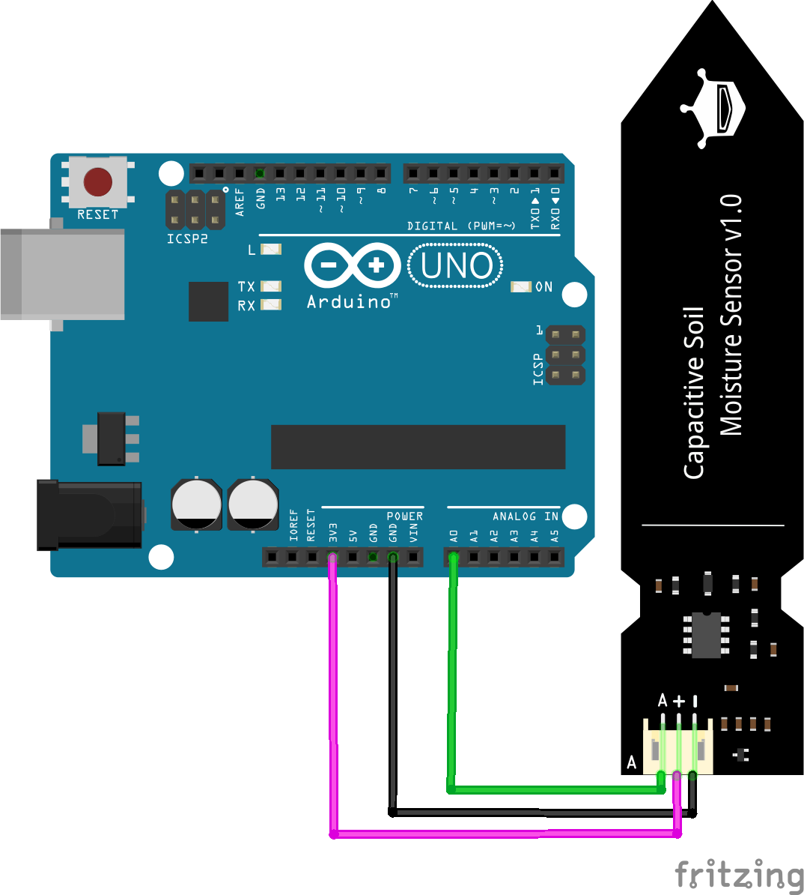
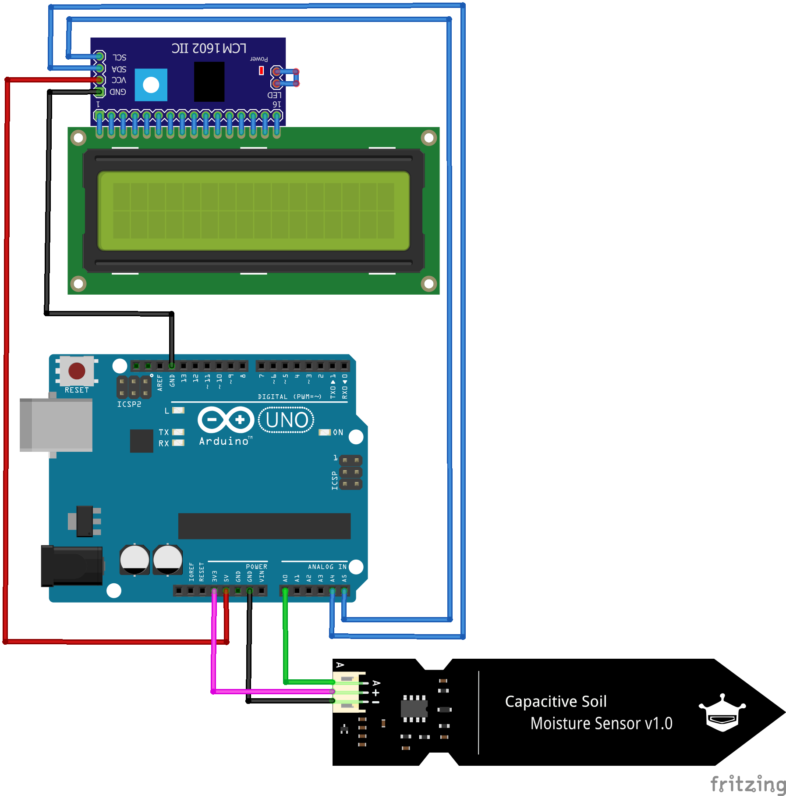
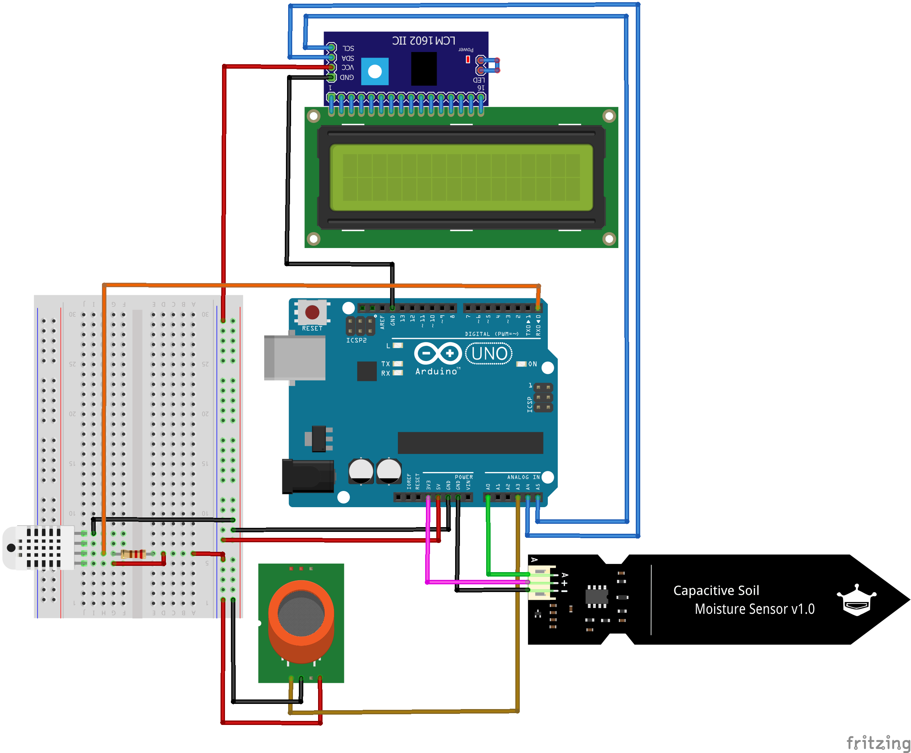
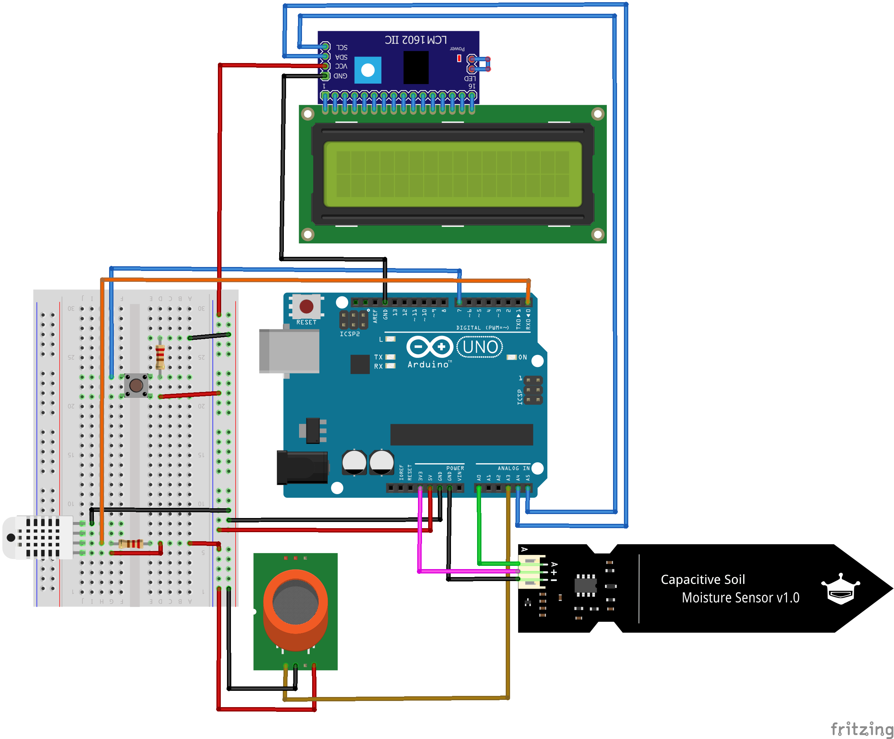

# ProPlant - Projektseite
**Ein Projekt von Nele und Tim Ratzka**


➜ <a href="https://github.com/NTCR7/ProPlant/blob/d34f1d9e749d0e4c48da18ffb45811cc4c291566/Studenprotokoll.md">**Entwicklungsprozess** (Stundenprotokolle)</a>

➜ <a href="https://youtu.be/4X6rJNSYpKE">**YouTube-Video**</a> 

## 1. Einleitung
<details>
<summary>𝟭.𝟭 𝗗𝗮𝘀 𝗶𝘀𝘁 𝗣𝗿𝗼𝗣𝗹𝗮𝗻𝘁</summary>
Mit ProPlant haben wir ein Produkt entwickelt, welches für die Überwachung der Gesundheit von Zimmerpflanzen zuständig ist. Dementsprechend wurde ProPlant mit verschiedenen Sensoren ausgestattet, um Daten zu überwachen. 
 
Besonders die Zufuhr von Wasser ist essenziell für das Überleben einer Pflanze. Es ist verantwortlich für den Zelldruck, den Nährstofftransport und stellt einen Bestandteil der Fotosynthese dar. ProPlant verfügt daher über einen Bodenfeuchtigkeitssensor, der entsprechende Daten sammelt. 
 
Ebenso bildet die Luft einen entscheidenen Einflussfaktor ab, den es zu regulieren gilt. Das Produkt überwacht daher die Temperatur, die Feuchtigkeit und den CO₂-Gehalt der Umgebung. So kann ein Vertrocknen oder Schimmel rechtzeitig verhindert werden. Der CO₂-Gehalt ist für die menschliche Gesundheit zu überwachen. Nämlich kann die Pflanze bei Nacht ohne Licht keine Fotosynthese betreiben, sondern sichert ihre Energiezufuhr durch Zellatmung. Dabei entsteht CO₂ als Abfallprodukt. Hegt man als besonderer Pflanzenliebhaber mehrere Pflanzen zuhause ohne regelmäßig durchzulüften, kann der erhöhte CO₂-Gehalt für den Menschen ungesund werden. Auch genrell ist der CO₂-Gehalt in der Luft für uns Menschen wichtig.

Anschließend bewertet ProPlant die Pflanzenwerte als gut oder schlecht. Der jeweilige Status wird anschließend auf einem Display wiedergegeben. So kann der Benutzer die Situation richtig einschätzen und festellen, wenn Handlungsbedarf besteht.
</details>


<details>
<summary>𝟭.𝟮 𝗗𝗲𝗿 𝗕𝗲𝘄𝗲𝗴𝗴𝗿𝘂𝗻𝗱</summary>
Wir leben in einer modernisierten Welt, die beständig nach Innovation und Verbesserung strebt. Bahnbrechende Erkenntnisse werden schnell in den Alltag eines Jeden 
integriert, sodass der Mensch lernen muss, sich diesen anzupassen. Gesundheit, Wohlstand oder auch die Möglichkeit nach Großem zu streben, sind positive Errungenschaften, die sich für einen grossen Teil der Gesellschaft als selbstverständlich etabliert haben.

Viel bedeutsamer ist hingegen die menschliche Augabe und Verpflichtung, sich manchen Umständen dieser Innovation zu beugen. Unteranderm muss das Individuum immer 
schneller und besser funktionieren, während es sich einem Grossenganzen fügt. 
Die Bereitschaft dem nachzugehen, muss jeder Mensch verkörpern, der in unserer Leistungsgesellschaft einen Platz einnehmen will. Somit ensteht jedoch für viele ein Alltag geprägt von Stress. Denn in unserer Welt wird Zeit zur neuen Kostbarkeit. Oft drängt es uns daher zu einer Auszeit von genau diesem Alltag. Wir wollen dieser lauten, vorbeirauschenden Welt entkommen. 

ProPlant - unser Projekt, beschäftigt sich mit einem Aspekt, um dieser Problematik der modernen Welt entgegzuwirken und zu entlasten. Zahlreiche Studien haben bewiesen, dass sich Pflanzen positiv auf die psychische Gesundheit auswirken. Sie erinnern uns an die Natur, welche das genaue Gegenteil einer grauen und gehetzten Arbeitswelt ist. Nicht ohne Grund lindert der Anblick von Pflanzen also Stress. Dies ist eine Option, sich der modernisierten Welt zu entziehen. 

Doch wie bereits angsprochen, ist ein großes Problem unsere Zeit. Manchmal scheint man einfach nie genug zu schaffen. Und dann soll noch Zeit sein, sich 
um eine Pflaze zu kümmern? Mit ProPlant wollen wir diesen Störfaktor ausklammern und einen Helfer bereitstellen. Denn ProPlant sammelt sorgfältig alle Daten, die
über die Gesundheit einer Pflaze bestimmen und wertet diese zuverlässig aus. So weiß der Besitzer nach einem Blick auf das Display, ob die Pflanze beispielsweise Wasser nötig hat. Schnell und unkompliziert.

Uns war es wichtig, mit unserem Projekt Impulse zu setzen in Richtung einer Innovation, die den Alltag erleichtert. Denn auch solche Errungenschaften sollten in der 
Gesellschaft integriert werden.
</details>


## 2. Die technische Umsetzung
<details>
<summary>𝟮.𝟭 𝗩𝗲𝗿𝘄𝗲𝗻𝗱𝗲𝘁𝗲 𝗣𝗿𝗼𝗴𝗿𝗮𝗺𝗺𝗲</summary>

#### <a href="https://www.arduino.cc/"></a></a> *Die Grundlage - der Arduino*
Das Fundament unseres Projektes stellt der Arduino UNO dar, denn ProPlant ist ein Physical computing Projekt. Vereinfacht involviert Physical computing interaktive
Systeme, die die Welt wahrnehmen und auf sie reagieren. Die Sensoren sammeln in unserem Fall Daten über eine Pflanze und  gegben sie an das System weiter. Dadurch wird
eine Reaktion ausgelöst. ProPlant zeigt nach der Auswertung dementsprechend einen Status auf dem Display an. Der Arduino vereint deshalb Soft- und Hardware. 

Die <a href="https://store.arduino.cc/products/arduino-uno-rev3">Hardware</a> besteht aus einer Platine mit Mikrocontroller, dem Herz des Boards. Diesen gilt es anzusteuern. Dies ist durch die 14 "Digital"-Pins und  6 "Analog"-Pins 
möglich, die für Signaleingänge und -ausgänge zuständig sind. Um den Mikrocontroller per Software zu programmieren und die Daten zu übertragen, ist ein USB-Anschluss
vorhanden, welcher mit einem Pc verbunden werden kann. 

Die <a href="https://www.arduino.cc/en/software">Arduino-Software</a> stellt die andere Hauptkompenente dar. Diese kann durch Programmiersprachen, angeleht an C, C++ und Java, genutzt werden.

#### <a href="https://fritzing.org/"></a><a href="https://fritzing.org/"> *fritzing*</a>
Physical-Computing Projekte erfordern die richtige Verkabelung der einzelnen Komponenten, um zu funktionieren. Jedoch ist jedes Projekt anderes und benötigt eine
individuelle Umsetzung, um auf die Bedürfnisse zugeschnitten zu sein. Bei komplexeren Projekten kann die eigene Schaltung schnell unübersichtlich und verkompliziert werden. Fritzing unterstützt dabei die digitale Visualisierung der Verkabelungen und wirkt so als Ordnungsfaktor. Aus einer Vielzahl elektronischer Bauteile kann die Schaltung am PC vorgefertigt und veranschaulicht werden. Somit dient die freie Software auch als Dokumentationstool.

#### <a href="https://github.com/"></a><a href="https://github.com/"> *GitHub*</a>
Github dient zur Softwareverwaltung und lässt sich gleichzetig als soziales Netzwerk für Entwickler charakterisieren. Somit wird die zeitgleiche Zusammenarbeit an Projekten und das Festhalten der Ergebnisse möglich. Für unser Projekt erfolgte die Dokumentation in Form von Stundenprotokollen und die Plattform diente zur Projektdarstellung.
 
</details>


<details>
<summary>𝟮.𝟮 𝗛𝗮𝗿𝗱𝘄𝗮𝗿𝗲</summary>
Die Hardware besteht bei ProPlant aus dem Arduino UNO, den Sensoren, einem LCD Display und einem Taster. Die Integrierung der einzelnen Bestandteile und ihre Verkabelung wird im Folgenden näher erleutert.
  
#### <a href="https://www.reichelt.de/de/de/entwicklerboards-feuchtesensor-bodenfeuchte--debo-cap-sens-p223620.html?PROVID=2788&gclid=EAIaIQobChMIpLGoyrO1-wIV7hkGAB0JYw15EAQYAyABEgJH_vD_BwE&&r=1">*Der Bodenfeuchtigkeitssensor (Capacitive Soil Moisture Sensor v2.0)*</a>
Dieser Sensor macht sich den dielektrischen Kontrast zwischen Wasser und Boden zu Nutze. Dabei wird die Kapazität der Erde gemessen, die sich durch Feuchtigkeit
verändert. Dies wird dann zu einem Wert umgewandelt, den der Arduino empfangen kann. 
Der Sensor muss mit GND verbunden werden, was für Ground steht. Denn hier ist das Potential 0 und das gleiche Bezugspotential wird verwendet, was die korrekte 
Funktion gewährleistet. Darüber hinaus wird der Sensor mit einem der Analog-Pins verbunden, damit der Arduino das analoge Signal des Sensors empfangen kann.
  <details>
    <summary>Konkrete Verkabelung</summary>
    
    </details>
 
#### <a href="https://t1p.de/jsotj">*Das LCD*</a>
Das Display dient zur Anzeige der pflanzlichen Gesundheit und spiegelt die Software wieder. Die Flüssigkristalle innerhalb ändern je nach Ausrichtung die Polarisationsebene des Lichts. Dieser Effekt wird durch das elektrische Feld beeinflusst.
  <details>
   <summary>Konkrete Verkabelung</summary>
   
   </details>
  
#### <a href="https://t1p.de/2uv02">*Der Luftemperatur- und Feuchtigkeitssensor (DHT22 AM2302)*</a>
Dieser Sensor ist in der Lage, Luftfeuchte als auch die -temperatur zu messen. Zur Messung der Luftfeuchtigkeit befindet sich ein feuchtigkeitshaltendes Substrat zwische zwei Elektroden. Wenn sich die Luftfeuchtigkeit ändert, verändert sich auch die Leitfähigkeit zwischen den Elektroden. Diese Widerstandsveränderung wird vom Chip erfasst und an den Arduino weitergeben.
Zur Temperaturmessung ist ein NTC-Temperaturfühler vorhanden. Auch bei diesem richtet sich der Widerstand nach dem gemessenen Wert.
   <details>
   <summary>Konkrete Verkabelung</summary>
   
   </details>
 
#### <a href="https://t1p.de/9du7c">*Der Luftsensor für den CO₂-Gehalt (MQ-135 Gassensor)*</a>
Der MQ-135 Gas Sensor bestimmt die Konzentration von Gasen und beruft sich auf chemische Reaktionen. Gase in der Nähe der Elektroden des Sensors reagieren mit den Chemikalien auf den Elektroden. Dies bewirkt eine Änderung des elektrischen Widerstands, was zu einem Konzentrationswert verabeitet werden kann. Für unser Projekt wird der CO₂-Gehalt gemessen.
  <details>
  <summary>Konkrete Verkabelung</summary>
  
  </details>
 
#### <a href="https://www.conrad.de/de/p/te-connectivity-1825910-2-drucktaster-24-v-dc-0-05-a-1-x-aus-ein-tastend-l-x-b-x-h-6-x-6-x-4-3-mm-1-st-701749.html?hk=SEM&WT.mc_id=google_pla&gclid=Cj0KCQiA14WdBhD8ARIsANao07gZZK9vtOoLXMF0hpUxqycq6qi0NnIvg7xLss9CvA5ZXasF6YGHFTYaAikGEALw_wcB">*Der Taster*</a>
Um die Benutzerfreundlichkeit zu erhöhen, haben wir einen noch einen Taster dazugenommen. Denn dieser fungiert als Impulsgeber, um einen neuen Prozess zu aktivieren. Zudem springt der Taster nachdem der Prozess durchlaufen ist, wieder zurück in seine Ausgangsstellung. Bei ProPlant wird im ungedrückten Zustand nacheinander der Zustand jedes Einflussfaktors angezeigt. Somit können alle Reguliergrößen im Blick behalten werden. Möchte man weitere Informationen über die konkrete Lage erlangen, kann der Taster gedrückt gehalten werden. Nun wird statt einer Auswertung von gut oder schlecht der konkrete Messwert wie die Temperatur in Grad Celsius angezeigt. Für die anderen Einflussgrößen werden Prozente wiedergegeben. So kann der Benutzer bei Bedarf feststellen, wie großer Handlungsbedarf tatsächlich besteht. Wurden alle Werte angezeigt, wird wie gewohnt wieder der Zustand der Pflanze auf dem Display wiedergegeben.
   <details>
   <summary>Konkrete Verkabelung</summary>
   
   </details>
 
</details>


<details>
<summary>𝟮.𝟯 𝗦𝗼𝗳𝘁𝘄𝗮𝗿𝗲</summary>
Nun haben wir ein System aus Sensoren, dem Arduinio, einem LCD Display und einem Taster vorliegen. Aber erst durch die Software kann die gewünschte Funktionsweise erzielt werden. Bei ProPlant sammeln die Sensoren Werte, welche zuerst zur Kontrolle im seriellen Monitor wiedergeben werden. Diese Werte werden als Variablen gespeichert und mithilfe von Intervallen bewertet. Auf dem LCD wird die jeweilige Bewertung als "good" oder "!bad!" angezeigt. Hinzu kommt noch der Taster, welcher dafür zuständig ist, zwischen der Auswertung und den konkreten Werten zu wechseln.
Der Code und seine Funktion wird im Folgenden erläutert.

```c
//  _____           _____  _             _                       _       _                _ 
// |  __ \         |  __ \| |           | |                     | |     (_)              | |
// | |__) | __ ___ | |__) | | __ _ _ __ | |_      _____  ___ __ | | __ _ _ _ __   ___  __| |
// |  ___/ '__/ _ \|  ___/| |/ _` | '_ \| __|    / _ \ \/ / '_ \| |/ _` | | '_ \ / _ \/ _` |
// | |   | | | (_) | |    | | (_| | | | | |_    |  __/>  <| |_) | | (_| | | | | |  __/ (_| |
// |_|   |_|  \___/|_|    |_|\__,_|_| |_|\__|    \___/_/\_\ .__/|_|\__,_|_|_| |_|\___|\__,_|
//                                                        | |
//                                                        |_|
//
// Einbinden von Bibliotheken für DHT22-Sensor und I2C-LCD-Display
#include <DHT.h>
#include "LiquidCrystal_I2C.h"

// Definieren der Konstante DHTPIN mit dem Wert 2, die den Anschluss-Pin angibt
#define DHTPIN 2

// Definieren der Konstante DHTTYPE, welche den Sensortyp (DHT22) angibt
#define DHTTYPE DHT22

// Erstellung eines neues DHT-Objekt und Initilaisierung mit "DHTPIN" und "DHTTYPE"
DHT dht(DHTPIN, DHTTYPE);

// Initialisierung I2C-LCD-Displays [Adresse 0x3F & Größe 16(Felder)x2(Zeilen)]
LiquidCrystal_I2C lcd(0x3F,16,2);

// Konstante für trockenen & feuchten Boden (wichtig zur Kalibrierung der Bodenfeuchtigkeit)
const int dry = 517;
const int wet = 231;

// Initialisierungsfunktion - wird einmalig zu Beginn des Skripts ausgeführt
void setup()
{
  // Initialisierung der seriellen Kommunikation mit 9600 Baud (Anzahl der Datenbits pro Sekunde)
  Serial.begin(9600);

  // Initialisierung DHT-Sensor
  dht.begin();

  // Initialisierung LCD-Display
  lcd.init();

  //Hintergrundbeleuchtung des LCD-Displays einschalten
  lcd.backlight();

  // Pin 7 als Eingang für Taster konfigurieren
  pinMode (7, INPUT) ;
}


// Hauptfunktion - wird immer wieder wiederholt, wenn das Skript ausgeführt wird
void loop()
{
  // Digitalen Eingang am Pin 7 auslesen und Wert in der Variable "SchalterZustand" speichern
  int SchalterZustand = digitalRead(7);

  // Analogen Eingang durch Feuchtigkeitssensor an Pin 0 auslesen und Wert in der Variable "sensorVal" speichern
  int soilraw = analogRead(A0);

  // Konvertiere den Eingangswert in Prozent um die Bodenfeuchtigkeit darzustellen, dabei sind wet und dry, minimale und maximale Werte.
  // Diese neuen Werte werden zudem in der Variablen "percentageHumidity" gespeichert
  int soilpercentage = map(soilraw, wet, dry, 100,0);

  // Bodenfeuchtigkeitswert über serielle Schnittstelle ausgeben
  Serial.print(String("SoilMoisture: ")+(soilpercentage)+"%  |  ");

  // DHT-Sensor auslesen und Feuchtigkeit in der Variablen "airhumi" speichern 
  float airhumi  = dht.readHumidity();

  // DHT-Sensor auslesen und Temperatur in der Variablen "tempC" speichern
  float tempC = dht.readTemperature();

  // Prüfen, ob der DHT-Sensor korrekt ausgelesen werden konnte - isnan bedeutet "is not a number"
  if (isnan(airhumi) || isnan(tempC))
  {
    // Falls nötig Fehlermeldung über serielle Schnittstelle ausgeben
    Serial.println("error DHT");
  }
  else
  {
    // Luftfeuchtigkeit über serielle Schnittstelle ausgeben
    Serial.print(String("AirHumidity: ")+(airhumi)+"%  |  ");

    // Lufttemperatur über serielle Schnittstelle ausgeben
    Serial.print(String("AirTemperature: ")+(tempC)+"°C  |  ");
  }
  
  // Analogen Eingang am Pin 2 auslesen und Wert in der Variable "MQValue" speichern
  int MQValue = analogRead(2);

  // CO2-Wert über serielle Schnittstelle ausgeben
  Serial.print(String("AirCO2: ")+(MQValue)+"PPM\n");
  
  // Wenn der Taster nicht gedrückt wird, good/!bad! für Bodenfeuchtigkeit, Luftfeuchtigkeit, Lufttemperatur & Luftqualität anzeigen
  if (SchalterZustand == 0)
    {
    // Text "ProPlant soil" auf Zeile 0 des LCD-Displays ausgeben
    lcd.setCursor(0,0);
    lcd.print ("ProPlant soil");
    
    // Text "moisture:" auf Zeile 1 des LCD-Displays ausgeben
    lcd.setCursor(0,1);
    lcd.print ("moisture: ");

    // Stelle für nächste Ausgabe
    lcd.setCursor(10,1);

    // Wenn der Bodenfeuchtigkeitswert im guten Bereich liegt, Text "good" ausgeben
    if ((soilpercentage > 20) && (soilpercentage < 60))  lcd.print("good     ");

    // Wenn der Bodenfeuchtigkeitswert im kritischen Bereich liegt, Text "!bad!" ausgeben
    if (soilpercentage < 20) lcd.print("!bad!     ");
    if (soilpercentage > 60) lcd.print("!bad!     ");

    // Ausgabe für 3 sec
    delay(3000);


    // Text "ProPlant air" in Zeile 0 auf LCD-Display ausgeben
    lcd.setCursor (0,0);
    lcd.print ("ProPlant air ");

    // Text "moisture:" auf Zeile 1 des LCD-Displays ausgeben
    lcd.setCursor(0,1);
    lcd.print ("moisture: ");

    // Stelle für nächste Ausgabe
    lcd.setCursor (10,1);

    // Wenn der Lufttemperaturwert im guten Bereich liegt, Text "good" ausgeben
    if ((airhumi > 55) && (airhumi < 75))  lcd.print("good     ");

    // Wenn der Lufttemperaturwert im kritischen Bereich liegt, Text "!bad!" ausgeben
    if (airhumi < 75) lcd.print("!bad!     ");
    if (airhumi > 55) lcd.print("!bad!     ");

    // Ausgabe für 3 sec
    delay(3000);


    // Text "temp:" auf Zeile 1 des LCD-Displays ausgeben
    lcd.setCursor (0,1);
    lcd.print ("temp: ");

    // Stelle für nächste Ausgabe
    lcd.setCursor (6,1);

    // Wenn der Lufttemperaturwert im guten Bereich liegt, Text "good" ausgeben
    if ((tempC > 16) && (tempC < 24))  lcd.print("good     ");

    // Wenn der Lufttemperaturwert im kritischen Bereich liegt, Text "!bad!" ausgeben
    if (tempC < 16) lcd.print("!bad!     ");
    if (tempC > 24) lcd.print("!bad!     ");

    // Ausgabe für 3 sec
    delay(3000);


    // Text "CO2:" auf Zeile 1 des LCD-Displays ausgeben
    lcd.setCursor (0,1);
    lcd.print ("CO2: ");

    // Stelle für nächste Ausgabe
    lcd.setCursor (5,1);

    // Wenn der Lufttemperaturwert im guten Bereich liegt, Text "good" ausgeben
    if (MQValue < 1000) lcd.print("good     ");

    // Wenn der Luftqualitätswert im kritischen Bereich liegt, Text "!bad!" ausgeben
    if (MQValue > 1000) lcd.print("!bad!     ");
    

    // Ausgabe für 3 sec
    delay(3000);
  }

  // Wenn der Taster gedrückt wird, alle reinen Werte der Sensoren anzeigen (selbe Reihenfolge)
  if (SchalterZustand == 1)
  {
    // Text "ProPlant soil" in Zeile 0 des LCD-Displays ausgeben
    lcd.setCursor (0,0);
    lcd.print ("ProPlant soil");

    // Text "moisture:" in Zeile 1 des LCD-Displays ausgeben
    lcd.setCursor(0,1);
    lcd.print ("moisture: ");

    // Stelle für nächste Ausgabe
    lcd.setCursor(10,1);

    // rohe Bodenfeuchtigkeit ausgeben
    lcd.print(String(soilpercentage)+"%     ");

    // Ausgabe für 3 sec
    delay(3000);


    // Text "ProPlant air " in Zeile 0 des LCD-Display ausgeben
    lcd.setCursor (0,0);
    lcd.print ("ProPlant air ");

    // Text "moisture:" in Zeile 1 des LCD-Displays ausgeben
    lcd.setCursor(0,1);
    lcd.print ("moisture: ");

    // rohe Luftfeuchtigkeit ausgeben
    lcd.setCursor (10,1);
    lcd.print (String(airhumi)+"%     ");

    // Ausgabe für 3 sec
    delay(3000);


    // Stelle für nächste Ausgabe
    lcd.setCursor (0,1);

    // Text "temp:" in Zeile 1 des LCD-Displays ausgeben
    lcd.print ("temp: ");
    lcd.setCursor (6,1);

    // rohe Luftfeuchtigkeit ausgeben
    lcd.print (String(tempC)+" C     ");
    
    // Ausgabe für 3 sec
    delay(3000);


    // Stelle für nächste Ausgabe
    lcd.setCursor (0,1);

    // Text "CO2" in Zeile 1 des LCD-Displays ausgeben
    lcd.print ("CO2: ");

    // rohe Luftfeuchtigkeit ausgeben
    lcd.setCursor (5,1);
    lcd.print (String(MQValue)+" PPM     ");

    // Ausgabe für 3 sec
    delay(3000);
  }
}
```      
</details>


 
<details>
<summary>𝟮.𝟰 𝗗𝗮𝘀 𝗘𝗿𝗴𝗲𝗯𝗻𝗶𝘀</summary>
 
#### *Code*
Unter Verwendung der
<a href="https://www.arduino.cc/reference/en/libraries/liquidcrystal-i2c/"> LiquidCristal library</a>,
<a href="https://www.arduino.cc/reference/en/libraries/dht-sensor-library/">DHT libary</a>
und
<a href="https://www.arduinolibraries.info/libraries/adafruit-unified-sensor">Adafruit Unified Sensor library</a> 
ist dies unser funktionfähiger Code:
  
```c
//  _____           _____  _             _   
// |  __ \         |  __ \| |           | |  
// | |__) | __ ___ | |__) | | __ _ _ __ | |_ 
// |  ___/ '__/ _ \|  ___/| |/ _` | '_ \| __|
// | |   | | | (_) | |    | | (_| | | | | |_ 
// |_|   |_|  \___/|_|    |_|\__,_|_| |_|\__|
//
#include <DHT.h>
#include "LiquidCrystal_I2C.h"
#define DHTPIN 2
#define DHTTYPE DHT22
DHT dht(DHTPIN, DHTTYPE);
LiquidCrystal_I2C lcd(0x3F,16,2);
const int dry = 517;
const int wet = 231;

void setup()
{
  Serial.begin(9600);
  dht.begin();
  lcd.init();
  lcd.backlight();
  pinMode (7, INPUT) ;
}

void loop()
{
  int SchalterZustand = digitalRead(7);
  int soilraw = analogRead(A0);
  int soilpercentage = map(soilraw, wet, dry, 100,0);
  Serial.print(String("SoilMoisture: ")+(soilpercentage)+"%  |  ");
  float airhumi  = dht.readHumidity();
  float tempC = dht.readTemperature();
  if (isnan(airhumi) || isnan(tempC))
  {
    Serial.println("error DHT");
  }
  else
  {
    Serial.print(String("AirHumidity: ")+(airhumi)+"%  |  ");
    Serial.print(String("AirTemperature: ")+(tempC)+"°C  |  ");
  }

  int MQValue = analogRead(2);
  Serial.print(String("AirCO2: ")+(MQValue)+"PPM\n");

  if (SchalterZustand == 0)
  {
    lcd.setCursor(0,0);
    lcd.print ("ProPlant soil");
    lcd.setCursor(0,1);
    lcd.print ("moisture: ");
    lcd.setCursor(10,1);
    if ((soilpercentage > 20) && (soilpercentage < 60))  lcd.print("good     ");
    if (soilpercentage < 20) lcd.print("!bad!     ");
    if (soilpercentage > 60) lcd.print("!bad!     ");
    delay(3000);
    lcd.setCursor (0,0);
    lcd.print ("ProPlant air ");
    lcd.setCursor(0,1);
    lcd.print ("moisture: ");
    lcd.setCursor (10,1);
    if ((airhumi > 55) && (airhumi < 75))  lcd.print("good     ");
    if (airhumi < 75) lcd.print("!bad!     ");
    if (airhumi > 55) lcd.print("!bad!     ");
    delay(3000);
    lcd.setCursor (0,1);
    lcd.print ("temp: ");
    lcd.setCursor (6,1);
    if ((tempC > 16) && (tempC < 24))  lcd.print("good     ");
    if (tempC < 16) lcd.print("!bad!     ");
    if (tempC > 24) lcd.print("!bad!     ");
    delay(3000);
    lcd.setCursor (0,1);
    lcd.print ("CO2: ");
    if (MQValue < 1000) lcd.print("good     ");
    if (MQValue > 1000) lcd.print("!bad!     ");
    lcd.setCursor (5,1);
    delay(3000);
  }
  if (SchalterZustand == 1)
  {
    lcd.setCursor (0,0);
    lcd.print ("ProPlant soil");
    lcd.setCursor(0,1);
    lcd.print ("moisture: ");
    lcd.setCursor(10,1);
    lcd.print(String(soilpercentage)+"%     ");
    delay(3000);
    lcd.setCursor (0,0);
    lcd.print ("ProPlant air ");
    lcd.setCursor(0,1);
    lcd.print ("moisture: ");
    lcd.setCursor (10,1);
    lcd.print (String(airhumi)+"%     ");
    delay(3000);
    lcd.setCursor (0,1);
    lcd.print ("temp: ");
    lcd.setCursor (6,1);
    lcd.print (String(tempC)+" C     ");
    delay(3000);
    lcd.setCursor (0,1);
    lcd.print ("CO2: ");
    lcd.setCursor (5,1);
    lcd.print (String(MQValue)+" PPM     ");
    delay(3000);
  }
}
```  
 
#### <a href="https://youtu.be/4X6rJNSYpKE"></a><a href="https://youtu.be/4X6rJNSYpKE"> *Video des funktionsfähigen Endproduktes*</a>
Aufgrund von fehlenden Breadboards und Kabeln konnten wir die Umsetzung der Verkabelung nicht noch weiter optimieren. Das Produkt als Ganzes im Video stellt momentan einen Prototypen dar. So sind die wichtigsten Grundgedanken jedoch verankert: Eine Powerbank zur Mobilität, das LCD eingelassen in der Hülle für optische Einheit und
das Außenliegen von Sensoren. Der Bodenfeuchtigkeitssensor kann in den Boden der Pflanze gesteckt werden und die Luftsensoren erfassen außerhalb der Produkthülle die Daten nähstmöglich zur Pflanze.

</details>


## 3. Reflexion
<details>
<summary>𝟯.𝟭 𝗥𝗲𝗳𝗹𝗲𝘅𝗶𝗼𝗻</summary>
Zwei Schüler ohne jegliche Programmierkenntnisse, jedoch getrieben von der Faszination, die eigene Idee umsetzen zu wollen. Dies fasst die Ausgangslage unseres
Projektes zusammen. Unsere Idee stand schnell fest, doch wie die Umsetzung zu gestalten war, bereitete uns Probleme. So mussten wir uns erst informieren, was überhaupt 
benötigt wird, um ein funktionierendes Produkt zu erschaffen. Vorerst gingen wir davon aus, die Werte als Benachrichtigung an ein anderes Gerät weiterleiten zu können.
 
Ohne Vorkenntnisse warf dies Fragen auf wie: Mit welchem Programm können die Werte ausgewertet werden? Müssen die Daten zwischengespeichert werden? Durch das Aneignen von Informationen wurde also klar, dass eine Datenbank benötigt wird. Doch so eine neue Erkenntnis führte uns zu weiteren Unklarheiten. Wie erstelle ich eine Datenbank? Wie binde ich diese ein? Bald mussten wir feststellen, dass wir wie anfänglich gedacht, unsere Idee nicht umsetzen können. Zumal diese ein RaspberryPi
benötigt hätte. 

So ging ärgerlicherweise Arbeit verloren, doch durch die Abänderung war unserer Rahmen greifbarer. Mit dem Arduino kamen wir fortan gut zurecht und konnten unser Projekt Schritt für Schritt visualisieren. Grundkenntnisse wie die Verwendung von if clauses oder die Einbindung von Variablen und Intervallen und vieles mehr konnten wir erlenen und anwenden. 
 
Mit diesem Grundwissen konnten wir schließlich knobeln, überlegen und verbessern, sodass wir eigenständig arbeiten konnten. Mit der eigenen Motivation ging nun auch der Spaß am Umdenken einher. Schlussendlich zahlte sich die Arbeitsbereitschaft und die Spätschichten vor dem PC zuhause auch in unserem Projekt aus. 

Ohne Vorkenntnisse ist es uns gelungen ein Projekt zu verwirklichen, welches eine Komplexität aufweist, die im Alltag tatsächlich nützlich ist. Unsere eigenen Anprüche 
konnten wir somit erfüllen. Nachhaltig konnten wir dabei auch wichtige Kenntnisse für das generelle Programmieren mitnehmen.
</details>


<details>
<summary>𝟯.𝟭 𝗭𝘂𝗸𝘂𝗻𝗳𝘁𝘀𝗶𝗱𝗲𝗲𝗻</summary>
Mit unserem Projekt als Ganzes haben wir ein funktionierendes und hilfreiches Produkt für den Alltag erschaffen. Für die Zukunft schwebt uns vor, dieses Projekt
noch auszuweiten. So soll der Benutzer push-Benachrichtigungen erhalten, wenn der Zustand der Pflanze kritisch ist.
Diesbezüglich kann der Nutzer die Daten benutzerfreundlich an einem anderen Gerät einsehen. 
</details>


## 4. Quellenangaben
<details>
<summary>ℹ️</summary>
 
*Code*
 
<a href="https://www.youtube.com/@MaxTechTV1"></a><a href="https://www.youtube.com/@MaxTechTV1"> MaxTechTV</a>

<a href="https://arduinogetstarted.com/tutorials/arduino-lcd-i2c"></a><a href="https://arduinogetstarted.com/tutorials/arduino-lcd-i2c"> arduinogetstarted.com</a>

<a href="https://funduino.de/anleitung-dht11-dht22"></a><a href="https://funduino.de/anleitung-dht11-dht22"> funduino.de</a>

<a href="https://github.com/"></a><a href="https://github.com/"> GitHub</a>
 
*Intervalle für Werte, die wir als Richtlinien verwendet haben*
 
<a href="https://www.greenwaybiotech.com/blogs/gardening-articles/how-soil-moisture-affects-your-plants-growth">optimale Bodenfeuchtigkeit</a>
 
<a href="https://www.brune.info/magazin/richtige-luftfeuchtigkeit-fuer-pflanzen/#:~:text=W%C3%A4hrend%20sich%20der%20Mensch%20bei,eine%20Feuchte%20%C3%BCber%2060%20Prozent.">optimale Luftfeuchtigkeit</a>
 
<a href="https://www.plantcaretools.com/de/temperatur-messen-zimmerpflanzen/#:~:text=Tags%C3%BCber%20ist%20eine%20Temperatur%20zwischen,32%C2%B0C.">optimale Lufttemperatur</a> 
 
<a href="https://www.dein-heizungsbauer.de/ratgeber/raumklima/co2-raumluft/">optimaler CO2-Gehalt</a> 

 
*Beschreibung der Sensoren und Bestandteile*

<a href="https://protosupplies.com/product/capacitive-soil-moisture-sensor-module/">capacitive soil moisture sensor</a>
 
<a href="https://www.lcd-module.de/knowhow.html#:~:text=LCD%20ist%20die%20Abk%C3%BCrzung%20von,Anlegen%20eines%20elektrischen%20Feldes%20beeinflusst.">LCD</a>
 
<a href="https://42project.net/dht11-dht22-sensoren-zur-messung-von-temperatur-und-feuchte-mit-dem-arduino-im-vergleich/">DHT22-Sensor</a>
 
<a href="https://www.nielit.gov.in/gorakhpur/sites/default/files/Gorakhpur/alevel_iot_13april20_SM.pdf">MQ-135 Sensor</a>
