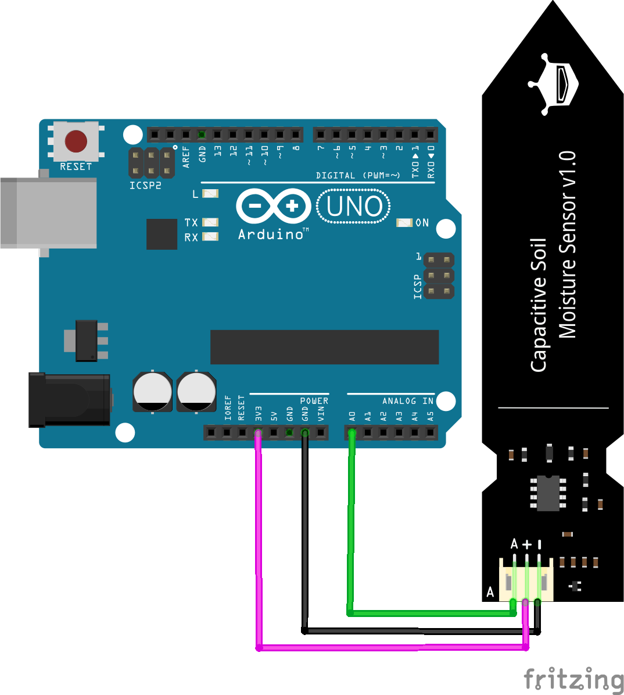
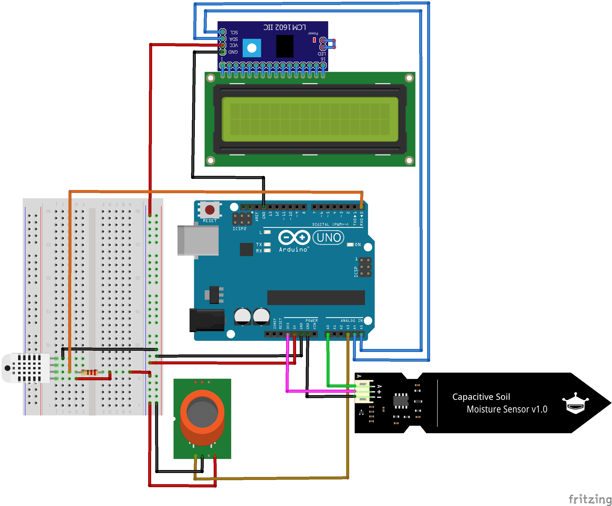
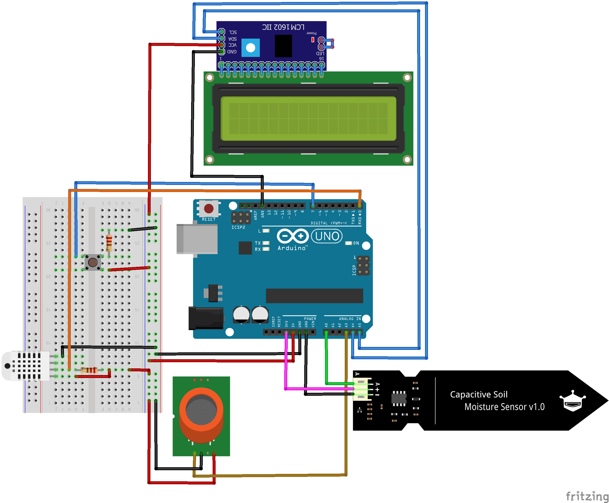
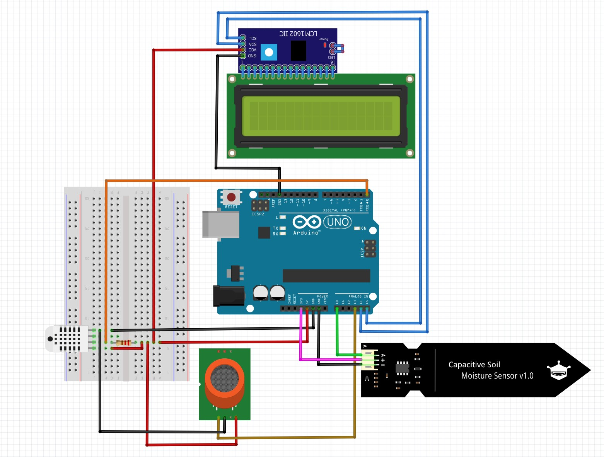

# ProPlant - Stundenprotokoll
**Ein Projekt von Nele und Tim Ratzka**


## Übersicht
<table align="center">
     
<tr>
    <td> <a href="https://github.com/NTCR7/ProPlant/blob/main/Studenprotokoll.md#stunde-220822"> Stunde 22.08.22 </a></td>
    <td> <a href="https://github.com/NTCR7/ProPlant/blob/main/Studenprotokoll.md#stunde-250822"> Stunde 25.08.22 </a></td>
    <td> <a href="https://github.com/NTCR7/ProPlant/blob/main/Studenprotokoll.md#stunde-290822"> Stunde 29.08.22 </a></td>
    <td> <a href="https://github.com/NTCR7/ProPlant/blob/main/Studenprotokoll.md#stunde-050922"> Stunde 05.09.22 </a></td>
    <td> <a href="https://github.com/NTCR7/ProPlant/blob/main/Studenprotokoll.md#stunde-080922"> Stunde 08.09.22 </a></td>
    <td> <a href="https://github.com/NTCR7/ProPlant/blob/main/Studenprotokoll.md#stunde-120922"> Stunde 12.09.22 </a></td>
    <td> <a href="https://github.com/NTCR7/ProPlant/blob/main/Studenprotokoll.md#stunde-190922"> Stunde 19.09.22 </a></td>
</tr>
<tr>
    <td> <a href="https://github.com/NTCR7/ProPlant/blob/main/Studenprotokoll.md#stunde-220922"> Stunde 22.09.22 </a></td>
    <td> <a href="https://github.com/NTCR7/ProPlant/blob/main/Studenprotokoll.md#stunde-260922"> Stunde 26.09.22 </a></td>
    <td> <a href="https://github.com/NTCR7/ProPlant/blob/main/Studenprotokoll.md#stunde-061022"> Stunde 06.10.22 </a></td>
    <td> <a href="https://github.com/NTCR7/ProPlant/blob/main/Studenprotokoll.md#stunde-241022"> Stunde 24.10.22 </a></td>
    <td> <a href="https://github.com/NTCR7/ProPlant/blob/main/Studenprotokoll.md#stunde-031122"> Stunde 03.11.22 </a></td>
    <td> <a href="https://github.com/NTCR7/ProPlant/blob/main/Studenprotokoll.md#stunde-071122"> Stunde 07.11.22 </a></td>
    <td> <a href="https://github.com/NTCR7/ProPlant/blob/main/Studenprotokoll.md#stunde-141122"> Stunde 14.11.22 </a></td>
</tr>
<tr>
    <td> <a href="https://github.com/NTCR7/ProPlant/blob/main/Studenprotokoll.md#stunde-171122"> Stunde 17.11.22 </a></td>
    <td> <a href="https://github.com/NTCR7/ProPlant/blob/main/Studenprotokoll.md#stunde-211122"> Stunde 21.11.22 </a></td>
    <td> <a href="https://github.com/NTCR7/ProPlant/blob/main/Studenprotokoll.md#stunde-121222"> Stunde 12.12.22 </a></td>
    <td> <a href="https://github.com/NTCR7/ProPlant/blob/main/Studenprotokoll.md#stunde-151222"> Stunde 12.12.22 </a></td>
</tr>
    </table>

<a href="https://github.com/NTCR7/ProPlant/blob/1be15cb7823f6d3c7ed0dff02a2df906a5430554/Projektseite.md">🔙zurück zur Projektseite</a>

## Stunde 22.08.22
Zuerst haben wir uns mit GitHub vertraut gemacht. Somit haben wir unser Repository für unser Stundenprotokoll erstellt und uns für ein Layout entschieden. Dafür haben wir uns eine Tabelle mit weiterführenden Links zu den einzelnen Stunden zur Hand genommen. Somit kann man über die <a href="https://github.com/NTCR7/ProPlant/blob/main/Studenprotokoll.md#%C3%BCbersicht">Übersicht</a> vom Anfang der Seite schnell und einfach zu den Ergebnissen einzelner Stunden navigieren. Danach haben wir erste Ideen zu unserem Projekt in Form einer Mindmap gesammelt.
<details>
    <summary>📝🧠Mindmap zur Ideensammlung</summary>
    
</details>

**Technisches:** Wir möchten also ein Gerät bauen, welches diverse Werte, welche für eine Pflanze wichtig sind, ausliest. Dabei sollen die Daten über eine Datenbank verarbeitet werden und dann auf einer Website angezeigt werden. Ebenso soll es sowohl einen Verlauf der erfassten Daten geben, aber das Programm soll so einfach wie möglich zu bedienen sein. Der Nutzer soll sich nicht lange mit den Daten rumschlagen müssen, um einen Handlungsbedarf festzustellen. Somit wird auf der Website direkt eine Aussage angezeigt, ob der Status optimal oder eine Handlung erforderlich für die Pflanze ist. 

> **Note**
> Vielleicht können wir später noch einen Bot (z. B. über Telegram) erstellen, welcher dann ganz unkompliziert bei Handlungsbedarf Push-Benachrichtigungen ans Handy sendet💬📱. Ein anderes praktisches Feature, welches man dann direkt mit einbinden könnte, wäre ein stündliches Updates über den Status der Pflanze. 

> **Warning**
> Den Push-Benachrichtigungen werden wir uns aber wahrscheinlich eher später als Zusatz zuwenden. 

**Namensgebung:** Da dies alles somit sehr fortschrittlich bzw. "professionell" sein wird, setzt sich unser Projektname bzw. Produktname aus *"pro"* 👨‍💻 (professional) und *"plant"* 🪴 zusammen - **ProPlant**!

## Stunde 25.08.22

Wir haben uns vor allem über MySQL, ein relationales Datenbankverwaltungssystem, informiert. Dieses System soll später für uns die Daten der Sensoren an der Pflanze verarbeiten. Problem ist momentan noch die Frage, worauf die Datenbank später laufen soll. Wir haben uns auch schonmal nach Bauteilen, besonders nach den Sensoren umgeschaut und des Weiteren kleinere Verbesserungen an unserem Repository vorgenommen. Unsere Sensoren werden die Feuchtigkeit des Bodens, als auch die Feuchtigkeit der Luft bestimmen. Die Temperatur wollen wir ebenfalls überwachen und auch die Luftqualität durch einen CO₂-Sensor, welche für uns Menschen wichtig ist. Eventuell kann man auch noch die Sonnenintensität bestimmen, aber dabei müssen wir noch schauen, ob Sensoren verfügbar sind. 

✅Wir haben aber schon einmal den 💧 Feuchtigkeitssensor (<a href="https://www.reichelt.de/de/de/entwicklerboards-feuchtesensor-bodenfeuchte--debo-cap-sens-p223620.html?PROVID=2788&gclid=EAIaIQobChMIpLGoyrO1-wIV7hkGAB0JYw15EAQYAyABEgJH_vD_BwE&&r=1">Capacitive Soil Moisture Sensor v2.0</a>) bestellt.

## Stunde 29.08.22


An diesem Tag haben wir uns weiterhin über die benötigten Programme informiert. Dabei haben wir uns angeschaut, wie man eine MySQL Datenbank über PhpMyAdmin erstellt und seine weiteren Funktionen. Außerdem wollen wir nun die Daten direkt auf dem Raspberry Pi auswerten, speichern und in die Website speisen. 
Darüber hinaus haben wir uns noch Gedanken über einen simplen Slogan gemacht. Um direkt im Englischen zu bleiben, wurde der Slogan "Alles für die Pflanze!" zu "all about plants" geändert. Somit fehlt uns noch ein Logo für unser Projekt "**ProPlant** - *all about plants*".

## Stunde 05.09.22
Nach der Informationssammlung in den letzten Stunden haben wir ein 1. Konzept erstellt, wie wir das Projekt letztendlich technisch umsetzen wollen:
<details>
    <summary>📝🔌Mindmap zur technischen Umsetzung</summary>
    
</details>
Dieses zeigt den Weg der Daten vom Sensor zur Website. Wir hoffen, ein Raspberry Pi zu erhalten, um die Datenbank und die Website auf diesem laufen zu lassen und somit alles an einem Ort verarbeiten zu können. Wir haben außerdem schon eine Möglichkeit gefunden, unsere Daten in 📈 Diagrammen darzustellen. Dabei kann uns der Open Source-Code von <a href="https://developers-dot-devsite-v2-prod.appspot.com/chart/interactive/docs/gallery/linechart.html">Google Charts</a> helfen.

## Stunde 08.09.22

Am heutigen Tag wollten wir uns den Raspberry Pi holen. Herr Buhl riet uns jedoch aufgrund der Schwierigkeit von dessen Benutzung ab und empfiehl stattdessen ein unkomplizierteres Projekt mit einem Arduino UNO. Leider wird es dabei schwieriger etwas auf einer Website anzuzeigen, aber wir werden dann dort erst einmal nur Daten vom Sensor auswerten und auf einem LCD anzeigen lassen.

Des Weiteren haben wir uns ein Logo für unser Projekt ausgedacht, indem wir eine Mindmap nach ausführlichem Brainstorming erstellt haben.
<details>
    <summary>📝🪴Mindmap zum Proplant-Logo</summary>
    
</details>
Zuhause konnten wir dann letztendlich ein finales Logo anfertigen.
<details>
    <summary>🪴ProPlant-Logo</summary>
    
</details>

## Stunde 12.09.22
Für unser Projekt haben wir uns nun das Auslesen der Daten als Alternative mit einem Arduino UNO nun weiter angeschaut. Dafür hatten wir bereits reichlich recherchiert und den <a href="https://www.reichelt.de/de/de/entwicklerboards-feuchtesensor-bodenfeuchte--debo-cap-sens-p223620.html?PROVID=2788&gclid=EAIaIQobChMIpLGoyrO1-wIV7hkGAB0JYw15EAQYAyABEgJH_vD_BwE&&r=1">Capacitive Soil Moisture Sensor v2.0</a> an den Arduino mithilfe folgender Verkabelung angeschlossen. 
<details>
    <summary>🔌Verkabelung</summary>
    
</details>
Danach ging es an den Code👾👨‍💻:

```c
void setup()
{ 
  Serial.begin(9600);
}

void loop()
{
  Serial.println(analogRead(A0));
  delay(100);
}
```

## Stunde 19.09.22
Nun haben wir die Werte vorliegen und können Sie am PC im seriellen Monitor anzeigen lassen. Jedoch ist dies für den alltäglichen Gebrauch äußert unpraktisch, da man die Pflanze erst zum PC tragen muss, um Daten über den seriellen Monitor auslesen zu können. Daher möchten wir die Werte inzwischen auf einem Display anzeigen lassen. Dazu haben wir uns für ein <a href="https://amzn.eu/d/iY7ifi8"> 16x2 LCD Modul Display</a> entschieden. Die Werte sollen darauf aber in Prozenten angezeigt werden, denn Pflanzen benötigen eine Bodenfeuchtigkeit von 20%-60%.

## Stunde 22.09.22
Wir haben heute das <a href="https://amzn.eu/d/iY7ifi8"> 16x2 LCD Modul Display</a> erhalten. Vorerst wollen wir aus den Zahlenwerten des Sensors noch Prozente erstellen - von 100% (extrem nass) zu 0% (trocken). Dazu testeten wir, welchen Wert der Sensor anzeigte, wenn wir ihn in Wasser (231) hielten und wenn er trocken (231) lag. Durch diese Werte wird der Sensor kalibriert und muss später nochmal vorgenommen werden, wenn wir den Sensor in der Pflanzenerde haben. 
Der Code für diese "Kalibrierung":
```c
const int dry = 517;
const int wet = 231;
```
<details>
    <summary>👾Letztendlicher Code:</summary>

```c
const int dry = 517;
const int wet = 231;

void setup()
{ 
  Serial.begin(9600);
}

void loop()
{
  int sensorVal = analogRead(A0);
  int percentageHumidity = map(sensorVal, wet, dry, 100,0);  //Verknüpfung von "dry" und "wet" mit 0 und 100
  Serial.print(percentageHumidity);
  Serial.print("%");
  delay(100);
}

```

</details>

Danach haben wir es direkt getestet, einmal den Sensor im Wasser und im Trocken ausgelesen.
<details>
    <summary> Testergebnisse</summary>
    
</details>
✅Die Testergebnisse waren bis auf leichte Abweichungen erfolgreich!

## Stunde 26.09.22
Nachdem der Test mit Prozenten erfolgreich verlaufen war, haben wir uns nun mit der Anzeige auf einem Display beschäftigt. Dafür haben wir die <a href="https://www.arduino.cc/reference/en/libraries/liquidcrystal-i2c/"> LiquidCristal library</a> miteinbezogen. 
<details>
    <summary>🔌Verkabelung</summary>
    
</details>

Nach der Verkabelung haben wir verschiedene Codes ausprobiert, um etwas auf dem Display anzuzeigen:
```c
#include "LiquidCrystal_I2C.h"
LiquidCrystal_I2C lcd(0x27,20,4); 

void setup() 
{ 
  lcd.init();
  lcd.backlight();
}

void loop() 
{
  lcd.setCursor(0,0);
  lcd.print("ProPlant");
  lcd.setCursor(0,1);
  lcd.print("test");
  delay(5000);
}
```
Jedoch zeigte das Display nichts an.
Nach längerem Herumprobieren konnten wir herausfinden, dass es an diesem Teil des Codes liegt:

```c
LiquidCrystal_I2C lcd(0x27,20,4); 
```
Dabei stellt der erste Teil die I²C-Adresse dar, über welche das LCD auf die Daten, die vom Arduino gesendet werden, reagiert. Der erste Teil muss daher so aussehen:
```c
LiquidCrystal_I2C lcd(0x3F,x,y); 
```
Darüber hinaus gibt x die maximal möglichen Zeich an, die in einer Reihe angezeigt werden können, hierbei 16. Y gibt die Spalten an, somit 2.
Letztendlich:
```c
LiquidCrystal_I2C lcd(0x3F,16,2); 
```
Das Display zeigt jedoch immer noch nichts an, uns fiel aber auf, dass es ungewöhnlich hell aussieht.


Das Potentiometer auf der Rückseite war das Problem, während wir unseren Code immer wieder durchgingen, war das Display zu hell eingestellt. Sodass man den Text nicht einmal mehr auf dem Display erkennen konnte.

Nachdem wir die Helligkeit etwas herunterregelten wurde endlich unser Test-Text angezeigt - das Display funktioniert!


## Stunde 06.10.22
Pflanzen sind auf eine bestimmte Bodenfeuchtigkeit angewiesen, bei welcher sie am besten gedeihen. Diese liegt optimalerweise zwischen 20% und 60%. Dementsprechend haben wir ein Intervall festgelegt, wobei das Display "good" anzeigt. Bei unserem ersten Versuch war der Befehl jedoch nicht eindeutig, sodass bei einer schlechten Bodenfeuchtigkeit fälschlicherweise "good !" angezeigt wurde. Die Auswirkungen auf das Display und der fehlerhafte Code sahen aus wie folgt:


Ursache:
```c
if (20 < percentageHumidity < 60) lcd.print("good "); //error
```
<details>
	<summary>👾gesamter fehlerhafter Code</summary>
	
```c
#include "LiquidCrystal_I2C.h"
LiquidCrystal_I2C lcd(0x3F,16,2); 
const int dry = 517;
const int wet = 231;

void setup() 
{
// moisture sensor
 Serial.begin(9600);

//display
lcd.init();
lcd.backlight();
}

void loop() 
{
//sensor
  int sensorVal = analogRead(A0);
  int percentageHumidity = map(sensorVal, wet, dry, 100,0);
  Serial.print(String(percentageHumidity)+"%\n");
//display
lcd.setCursor(0,0);
lcd.print ("ProPlant");
lcd.setCursor(0,1);
lcd.print ("moisture:");
lcd.setCursor(10,1);
if (30 < percentageHumidity < 60) lcd.print("good "); //<60 is the problem
if (percentageHumidity<30) lcd.print("!bad!");
if (percentageHumidity>60) lcd.print("!bad!");
delay(500);
}
```
	
</details>
     
Somit wurde der Print von "good" und "!bad!" vermischt. Das Problem lag an der Definition des Intervalls von "good". Somit änderten wir die Definition ganz einfach zu einem String aus <20 und >60.
```c
  if ((percentageHumidity>20) && (percentageHumidity<60))  lcd.print("good ");
```

<details>
	<summary>👾momentaner Code</summary>
	
```c
#include "LiquidCrystal_I2C.h"
LiquidCrystal_I2C lcd(0x3F,16,2); 
const int dry = 517;
const int wet = 231;

void setup() 
{
  // moisture sensor
  Serial.begin(9600);

  //display
  lcd.init();
  lcd.backlight();
}

void loop() 
{
//moisture sensor
  int sensorVal = analogRead(A0);
  int percentageHumidity = map(sensorVal, wet, dry, 100,0);
  Serial.print(String(percentageHumidity)+"%\n");
//display
lcd.setCursor(0,0);
lcd.print ("ProPlant");
lcd.setCursor(0,1);
lcd.print ("moisture:");
lcd.setCursor(10,1);
if ((percentageHumidity>20) && (percentageHumidity<60))  lcd.print("good ");
if (percentageHumidity < 20) lcd.print("!bad! ");
if (percentageHumidity > 60) lcd.print("!bad! ");
delay(500);
}
```
	
</details>

Anschließend wollten wir überprüfen, ob das Intervall sich wirklich korrekt integriert hatte. Dafür haben wir den Wert für "SensorVal" auf 45% gesetzt, welcher sich im Intervall "good" befindet. Dies wurde dann auch auf dem seriellen Monitor bzw. dem LCD angezeigt.


<details>
	<summary>👾Code für Test</summary>
	
```c
#include "LiquidCrystal_I2C.h"
LiquidCrystal_I2C lcd(0x3F,16,2); 
const int dry = 517;
const int wet = 231;

void setup() 
{
// moisture sensor
 Serial.begin(9600);

//display
lcd.init();
lcd.backlight();
}


void loop() 
{
//sensor
  int sensorVal = 45;  //value to test
  //int percentageHumidity = map(sensorVal, wet, dry, 100,0);
  Serial.print(String(sensorVal)+"%\n");
//display
lcd.setCursor(0,0);
lcd.print ("ProPlant");
lcd.setCursor(0,1);
lcd.print ("moisture:");
lcd.setCursor(10,1);
if ((sensorVal>20) && (sensorVal<60))  lcd.print("good ");
if (sensorVal<20) lcd.print("!bad!");
if (sensorVal>60) lcd.print("!bad!");
delay(500);
}
```
	
</details>

## Stunde 24.10.22
Nun möchten wir den <a href="https://amzn.eu/d/cYdimBH">DHT22</a> noch anschließen. Dieser soll insbesondere die Luftfeuchtigkeit anzeigen, da einige Pflanzen eine ganz bestimmte Luftfeuchtigkeit benötigen. Er kann aber auch die Lufttemperatur anzeigen, welches wir somit ebenfalls zu ProPlant hinzufügen können. Die Temperatur spielt nämlich vor allem im Winter eine wichtige Rolle für die Pflanze, da diese schon bei niedrigen Temperaturen sterben können.
Die Verkabelung war wie folgt:

<details>
    <summary>🔌Verkabelung</summary>
    
</details>

Daraufhin haben wir begonnen, den Code zu schreiben. Dazu mussten wir natürlich erst einmal die <a href="https://www.arduino.cc/reference/en/libraries/dht-sensor-library/">DHT library</a> einbinden, welche zusätzlich noch die <a href="https://www.arduinolibraries.info/libraries/adafruit-unified-sensor">Adafruit Unified Sensor library</a> benötigt. Danach wurden die Werte ausgelesen und wir haben den neuen Code vom DHT-Sensor direkt in unseren alten Code miteingebunden, sodass das Display immer zwischen den mittlerweile drei Werten hin- und herwechselt. Somit gibt es nun "ProPlant soil" und "ProPlant air" als Überschrift für die einzelnen Werte auf dem Display, um einfach zwischen den verschiedenen Feuchtigkeitswerten usw. zu unterscheiden. 

<details>
	<summary>👾Code</summary>
	
```c
#include <DHT.h>
#include "LiquidCrystal_I2C.h"
#define DHTPIN 2
#define DHTTYPE DHT22
LiquidCrystal_I2C lcd(0x3F,16,2); 
const int dry = 517;
const int wet = 231;
DHT dht(DHTPIN, DHTTYPE);

void setup() 
{
  Serial.begin(9600);
  //dht
  dht.begin();
  //display
  lcd.init();
  lcd.backlight();
}

void loop() 
{
  //moisture sensor SERIAL
  int sensorVal = analogRead(A0);
  int percentageHumidity = map(sensorVal, wet, dry, 100,0);
  Serial.print(String("SoilMoisture: ")+(percentageHumidity)+"%  |  ");
  //DHT SERIAL
  // read humidity
  float humi  = dht.readHumidity();
  // read temperature as Celsius
  float tempC = dht.readTemperature();
  // read temperature as Fahrenheit
  float tempF = dht.readTemperature(false);
  
  // check if any reads failed
  if (isnan(humi) || isnan(tempC))
  {
    Serial.println("error");
  } else {
    Serial.print("AirHumidity: ");
    Serial.print(humi);
    Serial.print("%");
    Serial.print("  |  "); 
    Serial.print("AirTemperature: ");
    Serial.print(tempC);
    Serial.print("°C\n");
    
    //display soil moisture
    lcd.setCursor(0,0);
    lcd.print ("ProPlant soil");
    lcd.setCursor(0,1);
    lcd.print ("moisture: ");
    lcd.setCursor(10,1);
    if ((percentageHumidity>20) && (percentageHumidity<60))  lcd.print("good  ");
    if (percentageHumidity < 20) lcd.print("!bad! ");
    if (percentageHumidity > 60) lcd.print("!bad! ");
    delay(3000);
    //display air moisture
    lcd.setCursor (0,0);
    lcd.print ("ProPlant air ");
    lcd.setCursor (10,1);
    lcd.print (String(humi)+"%");
    delay(3000);
    //display soil temprature
    lcd.setCursor (0,1);
    lcd.print ("temp: ");
    lcd.setCursor (6,1);
    lcd.print (String(tempC)+" C   "); 
    delay(3000); 
   }
}
```
</details>

<details>
    <summary>Anzeige von DHT auf LCD</summary>
    
    
</details>

## Stunde 03.11.22
Heute haben wir das <a href="https://amzn.eu/d/gWZVOSx">MQ-135 air quality module</a> angeschlossen.
<details>
    <summary>🔌Verkabelung</summary>
    
</details>

<details>
	<summary>👾Code</summary>
	
```c
#include <DHT.h>
#include "LiquidCrystal_I2C.h"
#define DHTPIN 2
#define DHTTYPE DHT22
LiquidCrystal_I2C lcd(0x3F,16,2); 
const int dry = 517;
const int wet = 231;
int MQValue;
DHT dht(DHTPIN, DHTTYPE);

void setup() 
{
  Serial.begin(9600);
  //dht
  dht.begin();
  //display
  lcd.init();
  lcd.backlight();
}

void loop() 
{
  //moisture sensor SERIAL
  int sensorVal = analogRead(A0);
  int percentageHumidity = map(sensorVal, wet, dry, 100,0);
  Serial.print(String("SoilMoisture: ")+(percentageHumidity)+"%  |  ");
  //DHT SERIAL
  // read humidity
  float humi  = dht.readHumidity();
  // read temperature as Celsius
  float tempC = dht.readTemperature();
  // read temperature as Fahrenheit
  float tempF = dht.readTemperature(false);
  
  // check if any reads failed
  if (isnan(humi) || isnan(tempC))
  {
    Serial.println("error");
  } 
  else 
  {
    Serial.print("AirHumidity: ");
    Serial.print(humi);
    Serial.print("%");
    Serial.print("  |  "); 
    Serial.print("AirTemperature: ");
    Serial.print(tempC);
    Serial.print("°C");
    Serial.print("  |  ");
   }
   
    //MQ Sensor
    MQValue = analogRead(2);       
    Serial.print("AirCO2: ");
    Serial.print(MQValue, DEC);               
    Serial.print("PPM\n");
  
    //display soil moisture
    lcd.setCursor(0,0);
    lcd.print ("ProPlant soil");
    lcd.setCursor(0,1);
    lcd.print ("moisture: ");
    lcd.setCursor(10,1);
    if ((percentageHumidity>20) && (percentageHumidity<60))  lcd.print("good  ");
    if (percentageHumidity < 20) lcd.print("!bad! ");
    if (percentageHumidity > 60) lcd.print("!bad! ");
    delay(6000);
    //display air moisture
    lcd.setCursor (0,0);
    lcd.print ("ProPlant air ");
    lcd.setCursor (10,1);
    lcd.print (String(humi)+"%");
    delay(3000);
    //display air temp
    lcd.setCursor (0,1);
    lcd.print ("temp: ");
    lcd.setCursor (6,1);
    lcd.print (String(tempC)+" C   "); 
    delay(3000); 
    //display air qua
    lcd.setCursor (0,1);
    lcd.print ("CO2: ");
    lcd.setCursor (5,1);
    lcd.print (String(MQValue)+" PPM   "); 
    delay(3000); 
}
```
	
</details>

<details>
    <summary>Anzeige von MQ-135 auf LCD</summary>
    
</details>

## Stunde 07.11.22
Wir haben nun sehr viele Werte vorliegen, welche dauerhaft auf dem LCD durchwechseln, jedoch sind manche Werte wichtiger als andere für die Pflanze. Am wichtigsten ist dabei "ProPlant soil" und somit die Bodenfeuchtigkeit. Daher wollen wir mittlerweile mithilfe eines Taster nur, die Werte von "ProPlant air", also die Feuchtigkeit, die Temperatur und die Qualität der Luft, wenn vorher ein Taster gedrückt wurde. Ansonsten soll dauerhaft die Bodenfeuchtigkeit angezeigt werden,zu welcher das LCD auch wieder wechselt, nachdem einmal alle 3 Werte angezeigt werden.

In dieser Stunde haben wir also versucht, den Taster anzuschließen. Dazu haben wir erst einmal im Internet recherchiert. Dabei landeten wir auf <a href="https://starthardware.org/lektion-12-der-taster-und-if-abfrage/">starthardware.org</a> und anderen Webseiten, welche uns sehr merkwürdige Lösungswege anboten.
Daher scheiterten wir in dieser Stunde leider mit dem Anschluss und Code des Tasters. Wir kamen zu Lösungen, bei welchen im seriellen Monitor angezeigt wurde, ob der Taser gedrückt ist oder gerade aus ist, aber nicht auf einfachem Wege, sondern mithilfe irgendwelcher libaries. Den Code und die genauen Quellen haben wir somit direkt wieder verworfen, da es zusätzlich zu dem aufwendigen Code nicht funktionierte. Wir konnten es aber Herr Buhl kurz zeigen, welcher uns auf einen einfacheren Lösungsweg verwies - ein Taster, welcher mithilfe der Abfrage einer Spannung funktioniert. Dadurch wird ein Strom nachgewiesen und somit, dass der Taster gedrückt ist.

## Stunde 14.11.22
Heute haben den Taster mit einer neuen Verkabelung an den Arduino angeschließen können.
<details>
    <summary>🔌Verkabelung</summary>
    
</details>
Danach ging es an den Code.

<details>
    <summary>👾Letztendlicher Code:</summary>

```c
void setup() 
{
    Serial.begin (9600) ;
    pinMode (7, INPUT) ;
}

void loop() 
{
int SchalterZustand = digitalRead(7);
//Serial.println(SchalterZustand,DEC);
if (SchalterZustand == 1) 
    {
    Serial.println("ON");
    }
if (SchalterZustand == 0) 
    {
    Serial.println("OFF");
    }
else {
     Serial.println("error");
     }
}
```

</details>

Bei Drücken des Tasters wurde nun "ON" im seriellen Monitor angezeigt, im ungedrückten Zustand "OFF".
<details>
    <summary>Taster: ON & OFF im seriellen Monitor</summary>
    
</details>

## Stunde 17.11.22
Da wir inzwischen das Drücken des Tasters an Variablen geknüpft haben, was wir durch den seriellen Monitor beweisen konnten, möchten wir das Drücken nun an die drei Werte der Luft knüpfen.

<details>
    <summary>👾Code:</summary>

```c
//taster control lcd
if (SchalterZustand == 0) 
    {
    lcd.setCursor(0,0);
    lcd.print ("ProPlant soil");
    lcd.setCursor(0,1);
    lcd.print ("moisture: ");
    lcd.setCursor(10,1);
    if ((percentageHumidity>20) && (percentageHumidity<60))  lcd.print("good  ");
    if (percentageHumidity < 20) lcd.print("!bad! ");
    if (percentageHumidity > 60) lcd.print("!bad! ");
    }
if (SchalterZustand == 1) 
    {
    //display air moisture
    lcd.setCursor (0,0);
    lcd.print ("ProPlant air ");
    lcd.setCursor (10,1);
    lcd.print (String(humi)+"%");
    delay(3000);
    //display air temp
    lcd.setCursor (0,1);
    lcd.print ("temp: ");
    lcd.setCursor (6,1);
    lcd.print (String(tempC)+" C   "); 
    delay(3000); 
    //display air qua
    lcd.setCursor (0,1);
    lcd.print ("CO2: ");
    lcd.setCursor (5,1);
    lcd.print (String(MQValue)+" PPM   "); 
    delay(3000); 
    }
```

</details>

Das haben wir dann einfach in unseren bisherigen Code eingepflegt.
  lcd.backlight();
<details>
    <summary>👾Code:</summary>

```c
#include <DHT.h>
#include "LiquidCrystal_I2C.h"
#define DHTPIN 2
#define DHTTYPE DHT22
LiquidCrystal_I2C lcd(0x3F,16,2); 
const int dry = 517;
const int wet = 231;
int MQValue;
DHT dht(DHTPIN, DHTTYPE);

void setup() 
{
  Serial.begin(9600);
  //dht
  dht.begin();
  //display
  lcd.init();
  //taster
  pinMode (7, INPUT) ;
}

void loop() 
{
  //taster
  int SchalterZustand = digitalRead(7);
  //moisture sensor serial
  int sensorVal = analogRead(A0);
  int percentageHumidity = map(sensorVal, wet, dry, 100,0);
  Serial.print(String("SoilMoisture: ")+(percentageHumidity)+"%  |  ");
  // DHT serial
  // read humidity
  float humi  = dht.readHumidity();
  // read temperature as Celsius
  float tempC = dht.readTemperature();
  // read temperature as Fahrenheit
  float tempF = dht.readTemperature(false);
  
  // check if any reads failed
  if (isnan(humi) || isnan(tempC))
  {
    Serial.println("error DHT");
  } 
  else 
  {
    Serial.print("AirHumidity: ");
    Serial.print(humi);
    Serial.print("%");
    Serial.print("  |  "); 
    Serial.print("AirTemperature: ");
    Serial.print(tempC);
    Serial.print("°C");
    Serial.print("  |  ");
   }
   
    //MQ Sensor serial
    MQValue = analogRead(2);       
    Serial.print("AirCO2: ");
    Serial.print(MQValue, DEC);               
    Serial.print("PPM\n");
//taster control lcd
//unpressed taster
if (SchalterZustand == 0) 
    {
    //display soil moisture
    lcd.setCursor(0,0);
    lcd.print ("ProPlant soil");
    lcd.setCursor(0,1);
    lcd.print ("moisture: ");
    lcd.setCursor(10,1);
    if ((percentageHumidity>20) && (percentageHumidity<60))  lcd.print("good  ");
    if (percentageHumidity < 20) lcd.print("!bad! ");
    if (percentageHumidity > 60) lcd.print("!bad! ");
    }
//pressed taster
if (SchalterZustand == 1) 
    {
    //display air moisture
    lcd.setCursor (0,0);
    lcd.print ("ProPlant air ");
    lcd.setCursor (10,1);
    lcd.print (String(humi)+"%");
    delay(3000);
    //display air temp
    lcd.setCursor (0,1);
    lcd.print ("temp: ");
    lcd.setCursor (6,1);
    lcd.print (String(tempC)+" C   "); 
    delay(3000); 
    //display air qua
    lcd.setCursor (0,1);
    lcd.print ("CO2: ");
    lcd.setCursor (5,1);
    lcd.print (String(MQValue)+" PPM   "); 
    delay(3000); 
    }
}
```

</details>

## Stunde 21.11.22
Am heutigen Tag haben wir uns der Erstellung unser Verkablung in <a href="https://fritzing.org/">fritzing</a> gewidmet. Somit können wir unsere Verkabelung übersichtlich visualisieren.

<details>
    <summary>🔌gesamte Verkabelung (keine echte Wiedergabe)</summary>
    gesamte Verkabelung (keine echte Wiedergabe)">
</details>

## Stunde 12.12.22
Krankheitsbedingter Ausfall von beiden Projektteilnehmern

## Stunde 15.12.22
Diesen Tag haben wir Überarbeitungen am Stundenprotokoll, der Projektseite und dem Code gewidmet.

Entfernte Zeile:
```c
float tempF = dht.readTemperature(false); //Überbleibsel von erster Auslesung, wobei wir noch Fahrenheit zusätzlich zu Grad Ceclcius bei AirTemp implementieren wollten
```
Wir haben uns außerdem dazu entschieden, dass alle Werte direkt ersichtlich sein sollen - nicht nur die Bodenfeuchtigkeit. Das bedeutet letztendlich, dass bei ungedrücktem Taster nacheinander alle überwachten Werte einen Status (good or !bad!) wiedergegeben werden. Durch Drücken des Tasters werden dann alle Werte in gleicher Reihenfolge, aber mit ihrem rohen Wert angezeigt. Man kann somit nicht nur einfach sehen, ob es der Pflanze gut geht, sondern bei Interesse die genauen Werte.

<details>
    <summary>👾Finaler gesamter Code:</summary>

```c
//  _____           _____  _             _   
// |  __ \         |  __ \| |           | |  
// | |__) | __ ___ | |__) | | __ _ _ __ | |_ 
// |  ___/ '__/ _ \|  ___/| |/ _` | '_ \| __|
// | |   | | | (_) | |    | | (_| | | | | |_ 
// |_|   |_|  \___/|_|    |_|\__,_|_| |_|\__|
//                                      
#include <DHT.h>
#include "LiquidCrystal_I2C.h"
#define DHTPIN 2
#define DHTTYPE DHT22
LiquidCrystal_I2C lcd(0x3F,16,2); 
const int dry = 517;
const int wet = 231;
int MQValue;
DHT dht(DHTPIN, DHTTYPE);

void setup() 
{
  Serial.begin(9600);
  //dht
  dht.begin();
  //display
  lcd.init();
  lcd.backlight();
  //taster
  pinMode (7, INPUT) ;
}

void loop() 
{
  //taster
  int SchalterZustand = digitalRead(7);
  //moisture sensor serial
  int soilraw = analogRead(A0);
  int soilpercentage = map(soilraw, wet, dry, 100,0);
  Serial.print(String("SoilMoisture: ")+(soilpercentage)+"%  |  ");
  // DHT serial
  // read humidity
  float airhumi  = dht.readHumidity(); //variable change
  // read temperature as Celsius
  float tempC = dht.readTemperature();
  // check if any reads failed
  if (isnan(airhumi) || isnan(tempC))
  {
    Serial.println("error DHT");
  } 
  else 
  {
    Serial.print("AirHumidity: ");
    Serial.print(airhumi);
    Serial.print("%");
    Serial.print("  |  "); 
    Serial.print("AirTemperature: ");
    Serial.print(tempC);
    Serial.print("°C");
    Serial.print("  |  ");
  }
   
  //MQ Sensor serial
  MQValue = analogRead(2);       
  Serial.print("AirCO2: ");
  Serial.print(MQValue, DEC);               
  Serial.print("PPM\n");
  
//taster control lcd
//unpressed taster - status
if (SchalterZustand == 0) 
    {
    //display soil moisture - status
    lcd.setCursor(0,0);
    lcd.print ("ProPlant soil");
    lcd.setCursor(0,1);
    lcd.print ("moisture: ");
    lcd.setCursor(10,1);
    if ((soilpercentage > 20) && (soilpercentage < 60))  lcd.print("good  ");
    if (soilpercentage < 20) lcd.print("!bad! ");
    if (soilpercentage > 60) lcd.print("!bad! ");
    //display air moisture - status
    lcd.setCursor (0,0);
    lcd.print ("ProPlant air ");
    lcd.setCursor (10,1);
    if ((airhumi > 55) && (airhumi < 75))  lcd.print("good  ");
    if (airhumi < 75) lcd.print("!bad! ");
    if (airhumi > 55) lcd.print("!bad! ");
    delay(3000);
    //display air temp - status
    lcd.setCursor (0,1);
    lcd.print ("temp: ");
    lcd.setCursor (6,1);
    if ((tempC > 16) && (tempC < 24))  lcd.print("good  ");
    if (tempC < 16) lcd.print("!bad! ");
    if (tempC > 24) lcd.print("!bad! ");
    delay(3000); 
    //display CO2 - status
    lcd.setCursor (0,1);
    lcd.print ("CO2: ");
    if (MQValue > 1000) lcd.print("good  ");
    if (MQValue < 1000) lcd.print("!bad! ");
    lcd.setCursor (5,1);
    delay(3000); 
    }
//pressed taster - raw
if (SchalterZustand == 1) 
    {
    //display soil moisture - raw
    lcd.setCursor (0,0);
    lcd.print ("ProPlant soil");
    lcd.setCursor(0,1);
    lcd.print ("moisture: ");
    lcd.setCursor(10,1);
    lcd.print(String(soilpercentage)+"%");
    delay(3000);
    //display air moisture - raw
    lcd.setCursor (0,0);
    lcd.print ("ProPlant air ");
    lcd.setCursor (10,1);
    lcd.print (String(airhumi)+"%");
    delay(3000);
    //display air temp - raw
    lcd.setCursor (0,1);
    lcd.print ("temp: ");
    lcd.setCursor (6,1);
    lcd.print (String(tempC)+" C   "); 
    delay(3000); 
    //display CO2 - raw
    lcd.setCursor (0,1);
    lcd.print ("CO2: ");
    lcd.setCursor (5,1);
    lcd.print (String(MQValue)+" PPM   "); 
    delay(3000); 
    }
}
```

</details>

<a href="https://github.com/NTCR7/ProPlant/blob/main/Studenprotokoll.md#%C3%BCbersicht">⬆️zur Übersicht</a>
